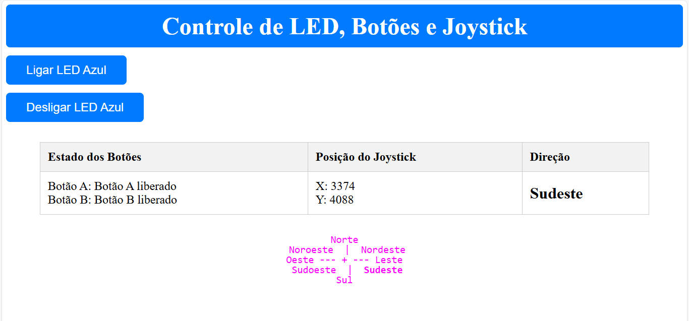

# Controle BitDogLab Raspberry Pi Pico do LED, Botões e Joystick

## Detalhes Deste Projeto
Este projeto visa conectar a placa com uma internet wifi especificada no código, depois de conectar será possivel vê em uma página local informações sobre o LED azul, sobre os botões A e B e sobre coordenadas do Joystick.
Como pode ser observada na imagem abaixo.



A primeira configuração realizada foi no arquivo do CMakeList, onde adicionei informações sobre FreeRTOS e bibliotecas que são utlizadas no progrma.


###  **CMAKELIST**
```c
target_link_libraries(Tarefa1_Unidade_II
        pico_stdlib    
         hardware_gpio
        hardware_adc
        pico_cyw43_arch_lwip_threadsafe_background
        FreeRTOS-Kernel
        FreeRTOS-Kernel-Heap4
        )
````

###  **Arquivo Principal**
Em seguida, foram definidos os pinos e as constantes para armazenar informações sobre o wifi, estado dos botões, coordenadas X, Y e direção do Joystick. 
Posteriormente, criou a função calcular_direcao, onde define como direções principais (Norte, Sul, Leste e Oeste) e como direções diagonais (Nordeste, Noroeste, Sudeste e Sudoeste).
    
            NORTE
     NOROESTE | NORDESTE
              |
    OESTE-----+-----LESTE
              |
     SUDOESTE |  SUDESTE
             SUL

###  **Outras demais funções e aspectos do projeto**
Funções para criar conexao, parte visual da rosa dos ventos que é exibida na parte inferior da página, botões para acender e apagar o LED azul na placa de forma remota, uma tabela na parte central de 3 colunas contendo informações se os botões físicos (A e B) estão precissionados ou liberados, coordenadas (X e Y) quando movimento o console do Joystick e com isso aparece em direção conforme a rosa dos ventos.
                

               
 
        

