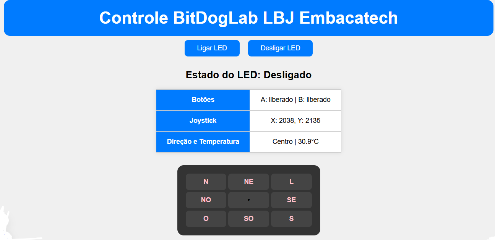

# Controle BitDogLab Raspberry Pi Pico do LED, Botões e Joystick

## Detalhes Deste Projeto
Este projeto visa conectar a placa com uma internet wifi especificada no código, depois de conectar será possivel vê em uma página local informações sobre o LED, sobre os botões A e B, sobre coordenadas do Joystick e temperatura.
Como pode ser observada na imagem abaixo.

<div align="center">
  
</div>


A primeira configuração realizada foi no arquivo do CMakeList, onde adicionei informações sobre FreeRTOS e bibliotecas que são utlizadas no progrma.


###  **CMAKELIST**
```c
target_link_libraries(Controle_BJL_VERSAO2
        pico_stdlib    
         hardware_gpio
        hardware_adc
        pico_cyw43_arch_lwip_threadsafe_background
        FreeRTOS-Kernel
        FreeRTOS-Kernel-Heap4     
        )
````

###  **Arquivo Principal**
Em seguida, foram definidos os pinos e as constantes para armazenar informações sobre o wifi, estado dos botões, coordenadas X, Y, direção do Joystick e temperatura. 
Posteriormente, criou a função calcular_direcao, onde define como direções principais (Norte, Sul, Leste e Oeste) e como direções diagonais (Nordeste, Noroeste, Sudeste e Sudoeste).
    
        

###  **Outras demais funções e aspectos do projeto**
Funções para criar conexao, parte visual da rosa dos ventos que é exibida na parte inferior da página, botões para acender e apagar o LED na placa de forma remota, uma tabela na parte central de 3 colunas contendo informações se os botões físicos (A e B) estão precissionados ou liberados, coordenadas (X e Y) quando movimento o console do Joystick, com isso aparece em direção conforme a rosa dos ventos e temperatura.

### **Principais Funcionalidades**
- Conexão com rede Wi-Fi
- Controle remoto do LED (ligar/desligar)
- Leitura da temperatura
- Monitoramento do estado dos botões (pressionado/liberado)
- Exibição das coordenadas (X e Y) e direção do joystick em uma rosa dos ventos
### **Stack Tecnológica**
- Linguagem C e Javascript
- Estrutura da página em HTML
- Estilo da página em CSS
- FreeRTOS
- Biblioteca lwIP (TCP/IP)
- Biblioteca GPIO e ADC do Raspberry Pi Pico
